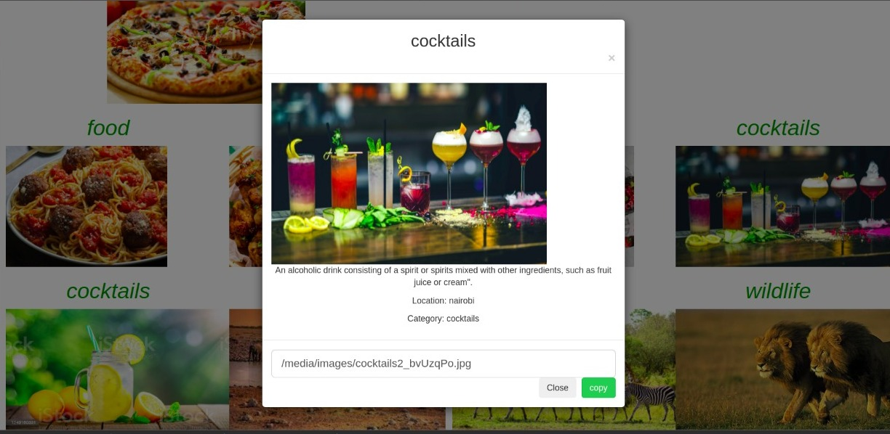

## Mems Gallery

## Author
Memory Wabwile 
https://github.com/Memory-Wabwile

## Description
Mems Gallery is an application showcasing the different pictures in mem's gallery. Users are able to view this different pictures and even copy the urls of the images incase they want to share.Users are also able to view the images depending on the location.

## Live Site
click on https://memsgallery.herokuapp.com/ to view the site

## BDD
1. A user is able to view different photos that interest me.
2. Click on a single photo to expand it and also view the details of the photo. The photo details appear on a modal within the same route as the main page.
3. A user is able to Search for different categories of photos. (ie. Wildlife, Art, Travel, Food )
4. A user is able to copy a link to the photo to share with my friends.
5. A user is able to view photos based on the location they were taken.

## Design
Landing page design for MemsGallery
 

## Technologies Used
<ul>Python 3.9</ul>

## Known Bugs
Currently there are no known bugs

## Dependancies
pyhton3.9  
Django Bootstrap3 
Python Venv 

## Setup instructions

Install python 3.9
<strong>To clone</strong>
<li>
<ul>Open the terminal</ul>
<ul> git clone https://github.com/Memory-Wabwile/Mems-Gallery.git</ul>
<ul>cd into the Mems gallery folder</ul>
<ul>type code . (on vs code) or atom . (on atom) to open the folder</ul>
</li>
Open the terminal of the text editor you are using and type "python manage.py runserver " to run the file 

## Contact Information
For any querries email me at memorywabwile@gmail.com

## License
Copyright (c) {2021} *{Wabwile Memory}*

Permission is hereby granted, free of charge, to any person obtaining a copy
of this software and associated documentation files (the "Software"), to deal
in the Software without restriction, including without limitation the rights
to use, copy, modify, merge, publish, distribute, sublicense, and/or sell
copies of the Software, and to permit persons to whom the Software is
furnished to do so, subject to the following conditions:

The above copyright notice and this permission notice shall be included in all
copies or substantial portions of the Software.